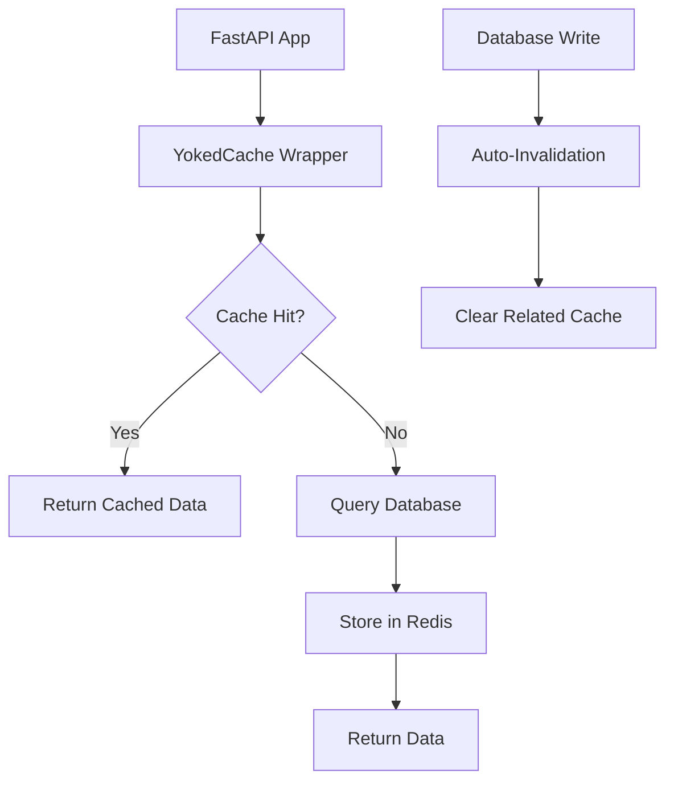

# YokedCache - Python Caching Library for FastAPI

High-Performance Redis Caching with Auto-Invalidation for Modern Python Applications

<div align="center">

[](https://github.com/sirstig/yokedcache/stargazers)

[](https://pypi.org/project/yokedcache/)
[](https://pypi.org/project/yokedcache/)
[](https://opensource.org/licenses/MIT)
[](https://github.com/sirstig/yokedcache/actions/workflows/test.yml)
[](https://codecov.io/gh/sirstig/yokedcache)
[](https://github.com/psf/black)


</div>

Intelligent Python caching library with automatic Redis invalidation, vector search caching, and seamless FastAPI integration.

**[Documentation](https://sirstig.github.io/yokedcache)** | **[Report Bug](https://github.com/sirstig/yokedcache/issues)** | **[Request Feature](https://github.com/sirstig/yokedcache/issues)**

## Table of Contents

- [Overview](#overview)
- [Key Features](#key-features)
- [Installation](#installation)
- [Quick Start](#quick-start)
- [Documentation](#documentation)
- [Performance](#performance)
- [Architecture](#architecture)
- [Testing](#testing)
- [Contributing](#contributing)
- [License](#license)

---

## Overview

YokedCache is a high-performance Python caching library designed for FastAPI applications. It provides intelligent automatic cache invalidation, eliminating the need for manual cache management. With multi-backend support, advanced caching patterns, and production-ready monitoring, YokedCache scales from development to enterprise deployment.

## Quick Start

```bash
pip install yokedcache
```

```python
from fastapi import FastAPI, Depends
from yokedcache import cached_dependency

app = FastAPI()

# Replace your database dependency
cached_get_db = cached_dependency(get_db, ttl=300)

@app.get("/users/{user_id}")
async def get_user(user_id: int, db=Depends(cached_get_db)):
    # Your existing code - no changes needed!
    return db.query(User).filter(User.id == user_id).first()
```

That's it! Your database queries are now cached with automatic invalidation.

## Key Features

### Advanced Caching Patterns v0.3.0

- **HTTP Response Middleware**: ETag/Cache-Control headers with 304 Not Modified responses
- **Single-Flight Protection**: Prevents cache stampede with automatic deduplication
- **Stale-While-Revalidate**: Serve stale data while refreshing in background
- **Stale-If-Error**: Fallback to cached data during service failures
- **Per-Prefix Routing**: Shard cache keys across multiple backends by prefix
- **OpenTelemetry Integration**: Distributed tracing with spans and metrics

### Production-Grade Resilience v0.2.1

- **Circuit Breaker Pattern**: Prevents cascading failures during cache outages
- **Connection Pool Management**: Advanced connection configuration and management
- **Retry Logic**: Exponential backoff for transient failures
- **Health Monitoring**: Comprehensive cache status and performance metrics
- **Graceful Fallbacks**: Application stability during cache issues

### Enhanced Async/Sync Support v0.2.1

- **Smart Context Detection**: Prevents Task object returns in mixed environments
- **Explicit Method Variants**: `aget`/`aset` for async, `get_sync`/`set_sync` for sync operations
- **FastAPI Generator Support**: Better handling of database session dependencies
- **Performance Optimization**: Improved serialization and key generation

### Multi-Backend Redis Caching Architecture

- **Redis**: Full-featured backend with clustering and persistence (default)
- **Memcached**: High-performance distributed caching
- **DiskCache**: Local disk-based persistent caching v0.3.0
- **SQLite**: Embedded database caching with TTL support v0.3.0
- **In-Memory**: Fast local Python caching for development and testing
- Pluggable backend system for custom implementations

### Intelligent Cache Invalidation

- Automatic cache invalidation on database writes
- Tag-based grouping for related data
- Pattern-based invalidation with wildcards
- Configurable rules per table/operation

### Advanced Search Capabilities

- **Vector Similarity Search**: Semantic search using TF-IDF and cosine similarity
- **Fuzzy Matching**: Traditional fuzzy search with configurable thresholds
- Multiple similarity algorithms (cosine, euclidean, manhattan)
- Real-time indexing and search

### FastAPI Integration

- Zero-code FastAPI integration via dependency caching
- SQLAlchemy ORM support
- Async/await throughout
- Connection pooling and health checks

### Production Monitoring

- **Prometheus**: Native metrics export for Grafana dashboards
- **StatsD**: Real-time metrics for DataDog, Grafana, and other platforms
- Comprehensive performance tracking and alerting
- Custom metrics collection support

### CLI and Tooling

- Comprehensive CLI for cache control and monitoring
- CSV export for data analysis and reporting
- Real-time statistics with watch mode
- YAML-based configuration with validation
- Cache warming and bulk operations

## Installation

```bash
# Basic installation (Redis backend only)
pip install yokedcache

# With specific features
pip install yokedcache[memcached]     # Add Memcached support
pip install yokedcache[monitoring]    # Add Prometheus/StatsD support
pip install yokedcache[vector]        # Add vector similarity search
pip install yokedcache[fuzzy]         # Add traditional fuzzy search
pip install yokedcache[disk]          # Add disk-based backend
pip install yokedcache[tracing]       # Add OpenTelemetry tracing

# Full installation with all features
pip install yokedcache[full]

# Development installation
pip install yokedcache[dev]
```

## Documentation

| Guide | Link | Description |
|-------|------|-------------|
| Quick Start | [Getting Started](#quick-start) | 5-minute integration guide |
| Full Documentation | [Documentation](https://sirstig.github.io/yokedcache) | Complete API documentation and guides |
| Examples | [Examples](examples/) | Real-world usage examples |
| CLI Guide | [CLI Documentation](https://sirstig.github.io/yokedcache/cli/) | Command-line tool documentation |

## Performance

| Metric | Improvement | Description |
|--------|-------------|-------------|
| Database Load | 60-90% reduction | Automatic query caching |
| Response Time | 200-500ms faster | Redis-fast cache hits |
| Memory Usage | Optimized | Efficient serialization |
| Setup Time | Under 5 minutes | Drop-in integration |

## Architecture



## Testing

YokedCache includes comprehensive test coverage for all features:

### Quick Verification

```bash
# Verify all features are working
python test_quick_verification.py
```

### Full Test Suite

```bash
# Install development dependencies
pip install yokedcache[dev]

# Run all tests
pytest

# Run with coverage
pytest --cov=yokedcache --cov-report=html

# Run specific feature tests
pytest tests/test_backends.py      # Multi-backend tests
pytest tests/test_vector_search.py # Vector similarity tests
pytest tests/test_monitoring.py    # Monitoring tests
pytest tests/test_cli.py           # CLI tests
```

### Test Categories

- **Backend Tests**: Memory, Redis, Memcached implementations
- **Vector Search Tests**: TF-IDF, cosine similarity, semantic search
- **Monitoring Tests**: Prometheus, StatsD, metrics collection
- **CLI Tests**: CSV export, search commands, configuration
- **Integration Tests**: End-to-end workflows and error handling

For detailed testing information, see the [Testing Guide](docs/testing.md).

## Contributing

We welcome contributions! Here's how to get started:

1. Fork the repository
2. Create a feature branch: `git checkout -b feature/amazing-feature`
3. Make your changes and add tests
4. Commit your changes: `git commit -m "feat: add amazing feature"`
5. Push to the branch: `git push origin feature/amazing-feature`
6. Open a Pull Request

See [CONTRIBUTING.md](CONTRIBUTING.md) for detailed guidelines.

## Project Status

[](https://github.com/sirstig/yokedcache/stargazers)
[](https://github.com/sirstig/yokedcache/network/members)
[](https://github.com/sirstig/yokedcache/issues)
[](https://github.com/sirstig/yokedcache/pulls)

## License

This project is licensed under the MIT License - see the [LICENSE](LICENSE) file for details.

---

**Made with care by [SirStig](https://github.com/sirstig)**
