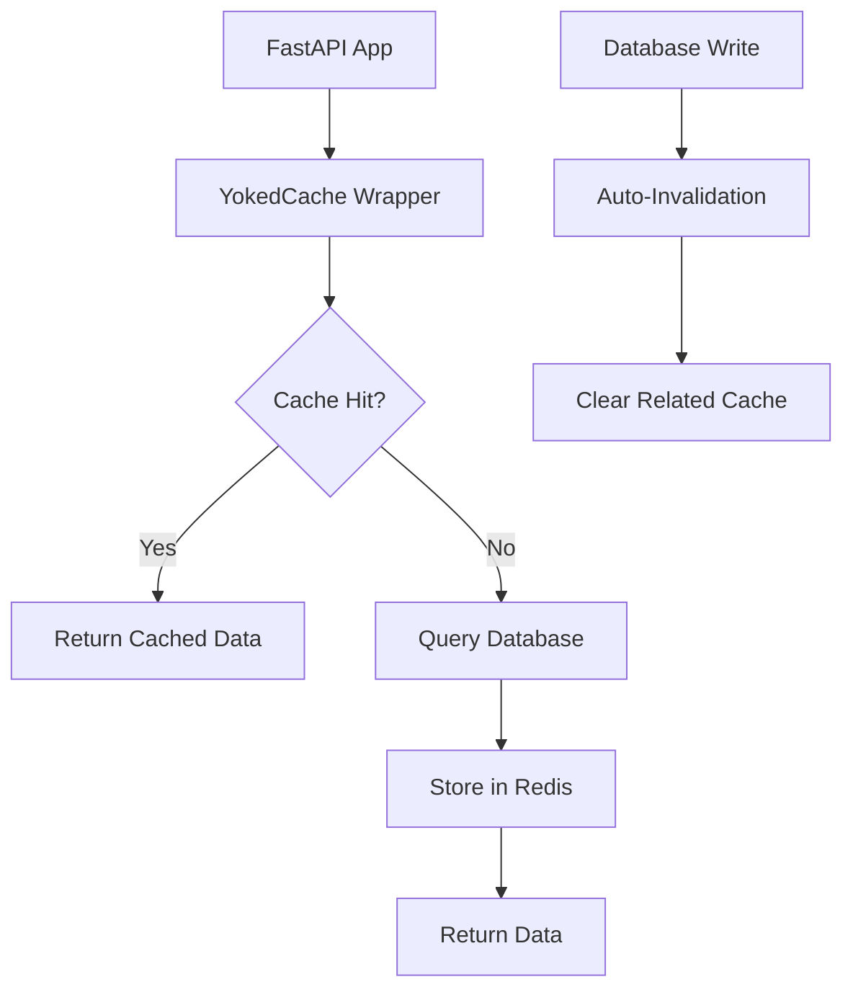

# Architecture

```mermaid
graph TB
    A[FastAPI App] --> B[YokedCache Wrapper]
    B --> C{Cache Hit?}
    C -->|Yes| D[Return Cached Data]
    C -->|No| E[Query Database]
    E --> F[Store in Redis]
    F --> G[Return Data]
    H[Database Write] --> I[Auto-Invalidation]
    I --> J[Clear Related Cache]
```
